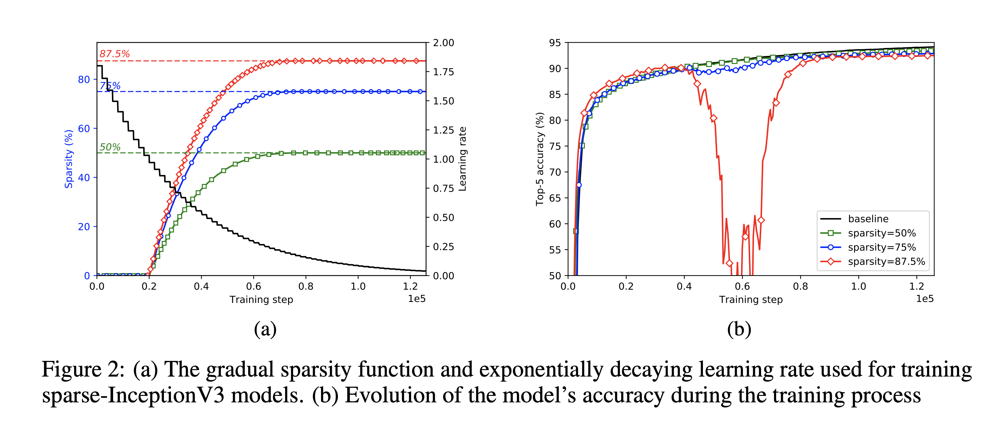
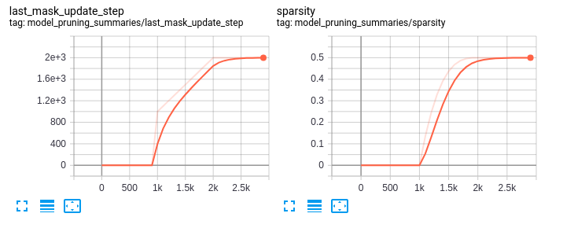

# Pruning Object Detection Models with TensorFlow

At the moment there is no official model pruning support for TensorFlow's 1.x Object Detection
API. This repo attempts to solve this issue. A base example is setup for the InceptionV2-based
FasterRCNN models.

This repo contains the full code for the blog post: [Pruning Mask RCNN Models with TensorFlow](https://panch.io/articles/2020-05/pruning-mask-rcnn-models-with-tensorflow)



## Setup

Clone repo with submodules
```bash
git clone --recurse-submodules git@github.com:panchgonzalez/tf_object_detection_pruning.git
cd tf_object_detection_pruning
```

Apply patch to `tensorflow.contrib.model_pruning` library and compile

```bash
cd tensorflow

# Apply patch
git apply -v ../tf_model_pruning.patch

# Compile
bazel build tensorflow/contrib/model_pruning:strip_pruning_vars
```

Apply patch to `models.research.object_detection` and  `models.research.slim` libraries
that will allow us to prune InceptionV2 based MaskRCNN models

```bash
cd models

# Apply patch
git apply -v ../object_detection_pruning.patch

# Compile object detection protobufs
pushd research
protoc object_detection/protos/*.proto --python_out=.

# Install object detection
pip install .
popd

# Install slim
pushd research/slim
pip install .
popd

# Compiling and installing cocoapi
cd ../cocoapi
python setup.py build_ext --inplace
make
python setup.py install
cp -r pycocotools ../models/research
```

## Train with Model Pruning

To train with model pruning turned on pass the following flags to `model_main.py`

- `--sparsity`: target sparsity level
- `--pruning_start_step`: start pruning at this training step
- `--pruning_start_step`: stop pruning at this training step


```bash
python ${OBJECT_DETECTION_PATH}/object_detection/model_main.py \
    --pipeline_config_path=${PIPELINE_CONFIG_PATH} \
    --model_dir=${MODEL_DIR} \
    --sample_1_of_n_eval_examples=$SAMPLE_1_OF_N_EVAL_EXAMPLES \
    --alsologtostderrcd ../ \
    --throttle_secs=2100 \
    --sparsity=0.85 \
    --pruning_start_step=100000 \
    --pruning_end_step=200000
```

During training you can check the overall sparsity in tensorboard



## Known issues:

It seems that training with TF 1.15 returns the following runtime error
```
RuntimeError: Init operations did not make model ready for local_init. Init op: group_deps, init fn: None, error: Variables not initialized: model_pruning/last_mask_update_step
```
This is fixed by downgrading to TF 1.14. Thanks to [@anshkumar](https://github.com/anshkumar) for pointing this out.

## References

Michael Zhu and Suyog Gupta, “To prune, or not to prune: exploring the efficacy of pruning for model compression”, *2017 NIPS Workshop on Machine Learning of Phones and other Consumer Devices* (https://arxiv.org/pdf/1710.01878.pdf)
